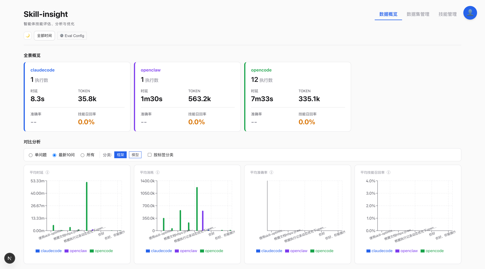

<p align="center">
  <a href="https://gitcode.com/openeuler/witty-skill-insight">
    <strong style="font-size: 2em;">Skill-insight</strong>
  </a>
</p>
<p align="center">Transform Agent Skills from "usable" to "excellent" — a full lifecycle platform for Skill generation, evaluation, and optimization based on execution data</p>
<p align="center">
  <a href="https://www.npmjs.com/package/@witty-ai/skill-insight"></a>
  <a href="https://gitcode.com/openeuler/witty-skill-insight/blob/main/LICENSE"></a>
</p>

<p align="center">
  <a href="README.md">简体中文</a> |
  <a href="README_en.md">English</a>
</p>

[](https://gitcode.com/openeuler/witty-skill-insight)

---

## Why Skill-insight

Skills are becoming a key enabler for Agent adoption, but three common problems arise in practice:

- **More Skills, worse experience**: Similar documents generate redundant Skills. Studies show recall drops from 95% to below 30% when Skills exceed 40-50
- **Execution process invisible**: Evaluation only checks "task completion" — even correct results may skip critical steps, hiding risks
- **Optimization by guesswork**: Without execution data, improvement relies on trial-and-error based on outcomes, unable to pinpoint bottlenecks

Skill-insight is designed to solve these problems.

## Core Features

### 🔨 Skill Generation — One-liner generation, batch deduplication

- Generate Skills with a single sentence
- Automatically deduplicate, merge similar content, and extract patterns during batch generation to reduce Skill proliferation
- Support multiple data sources: Markdown, PDF, directories, URLs, etc.

### 📊 Multi-dimensional Evaluation & Execution Tracing

- Cover multiple dimensions: effectiveness (accuracy, Skill recall, Skill improvement rate), efficiency (latency, call count), cost (Token, model cost, CPSR)
- Automatically generate execution flowcharts, compare step-by-step with expected Skill workflow, mark deviations, redundancies, and skips
- Support cross-comparison analysis from four dimensions: Skill, framework, model, and task
- More metrics in [Metrics Details](docs/metrics.md)

### 🔄 Data-driven Skill Self-optimization

- Based on evaluation attribution results, automatically locate Skill defects and apply targeted fixes
- Distinguish Skill design issues from model capability issues to avoid "fixing the wrong direction"
- Form a continuous improvement loop: **Evaluate → Attribute → Optimize → Re-evaluate**

## Supported Frameworks

| Agent Framework | Collection Method |
|:---------------|:-----------------|
| OpenCode       | Native plugin    |
| Claude Code    | Log bypass       |
| OpenClaw       | Log bypass       |

## Installation

```bash
# One-line install
npx @witty-ai/skill-insight install

# Package manager
npm i -g @witty-ai/skill-insight
```

> [!TIP]
> After installation, visit the dashboard at `http://localhost:3000` with default account `admin`.

### Install from Source

```bash
git clone https://gitcode.com/openeuler/witty-skill-insight.git
cd witty-skill-insight
npm install

# Development mode
bash scripts/restart_dev.sh

# Production mode
bash scripts/restart.sh

# Configure data reporting path
curl -sSf http://<IP>:<PORT>/api/setup | bash
```

## Quick Start

The following example uses OpenCode to demonstrate the complete Generate → Evaluate → Optimize workflow.

**Prerequisites**: Skill-insight platform and OpenCode installed.

### Step 1: Install Skill Toolkit

```bash
npx skills add https://gitcode.com/openeuler/witty-skill-insight.git
```

### Step 2: Generate Skill

In OpenCode terminal, enter:

```
Generate a Skill from the case document Docker-application-hang-case.pdf
```

### Step 3: Execute Task

Place the generated Skill in OpenCode's Skill directory, then execute:

```
My locally deployed Docker application sometimes hangs. Use the relevant skill to analyze the cause and provide a report
```

### Step 4: View Results

After task completion, click **View Details** in the Skill Insight card on the top-right of OpenCode terminal to jump to the platform and view execution details.

### Step 5: Deep Evaluation (optional)

To use deep evaluation capabilities like accuracy, Skill recall, and failure attribution:

1. Click **⚙️ Eval Config** on the top-left of the platform homepage, add evaluation model configuration (supports DeepSeek / OpenAI / Anthropic / custom)
2. Click **Dataset Management** on the top-right, configure user questions, expected answers, and expected Skills

### Step 6: Optimize Skill

In OpenCode terminal, enter:

```
/si-optimizer <path-to-Skill-to-optimize>
```

After optimization, the Skill will be automatically loaded into OpenCode's Skill directory. Restart OpenCode and execute the same task again to compare before/after optimization results on the platform.

## Documentation

Detailed usage guides in [docs/guide](docs/guide/) directory.

## Contributing

Before contributing code, please sign the [CLA](https://clasign.osinfra.cn/sign/6983225bdcbb19710248ccf0) and follow the [Code Contribution Guide](https://www.openeuler.org/en/community/contribution/).

---

**Join the Community** [Issue](https://atomgit.com/openeuler/witty-skill-insight/issues) | <intelligence@openeuler.org>