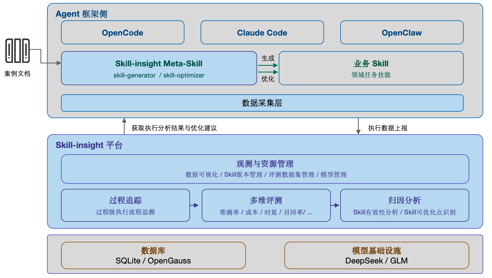

# 认识 Skill-insight

> **版本**: v5.0.0
> **更新日期**: 2026年4月

***

## 背景

随着 Agent 技术的快速发展，Skill 作为行业与领域知识的载体，正在被大量生产出来。这是好事，但也带来了新问题：

- **Skill 数量膨胀，召回率下降**：同一类问题往往存在多份相似文档，生成的 Skill 高度重复。研究表明，当 Skill 数量超过 40-50 个后，召回率会从 95% 急剧下降至 30% 以下，同时 Token 消耗大幅增加。
- **评测停留在结果层，过程不可追溯**：当前评测大多只看"任务是否完成"，无法判断执行路径是否正确。即使结果正确，如果 Agent 跳过了关键的备份或检查步骤，仍然可能埋下隐患。
- **优化缺乏数据支撑，难以持续改进**：没有执行过程数据，优化只能基于结果反馈做浅层调整，无法定位具体瓶颈和风险点。

这三个问题指向同一个根因：**缺少以执行过程数据为核心的闭环能力。**

**Skill-insight** 正是为了解决这些问题而生的。它是 openEuler 社区推出的开源项目，定位为面向 Skill 全生命周期管理的工具平台，覆盖 Skill 的"生成 → 评测 → 优化"闭环，让执行过程数据成为 Skill 持续进化的核心驱动力。

> 项目地址：<https://atomgit.com/openeuler/witty-skill-insight>

***

## 适用对象

| 角色 | 典型使用场景 |
| :--- | :--- |
| **Skill 开发者** | 编写和调优 Skill，借助评测数据持续改进 |
| **Agent 使用者** | 观测 Agent 执行过程，了解任务完成质量 |

***

## 核心能力

Skill-insight 提供三大核心能力，形成 **生成 → 评测 → 优化** 的完整闭环。

### 1. 基于语义聚合的 Skill 生成

针对大量相似文档生成冗余 Skill 的问题，Skill-insight 采用"去冗余、合相似、抽模式"的方法：

- **去冗余**：从碎片化的案例文档中剔除重复内容和噪声信息，保留核心特征和关键步骤
- **合相似**：基于文本聚类和语义理解，将同类问题的多份文档合并，提炼共性逻辑
- **抽模式**：在合并基础上提炼通用执行路径，生成标准化、可复用的 Skill

通过这种方式，可以在不丢失关键信息的前提下有效减少 Skill 数量，提升召回率的同时降低 Token 消耗。

### 2. 多维评测与过程级可追溯

不同于只看结果的评测方式，Skill-insight 构建了涵盖准确率、时延、Token 成本、投入产出比等多维度的评测体系，并提供过程级可追溯能力：

- 实时生成 Agent 执行流程图，与 Skill 预定义流程进行对比
- 清晰标识跳过的步骤、非预期操作和流程偏差
- 支持逐步回溯执行记录，定位偏差的根本原因

评测从"结果判断"升级为"结果 + 路径 + 成本"的综合分析，让执行过程看得见、可追溯。

### 3. 数据驱动的 Skill 自优化

当执行过程被结构化记录后，优化就不再依赖猜测。Skill-insight 能够：

- 全面记录每一步操作、模型推理、工具调用等执行数据
- 自动分析缺陷原因，区分是 Skill 设计问题还是模型能力问题
- 基于真实数据定位瓶颈，针对性地修补 Skill（如补充缺失的备份步骤、优化冗余流程）

让 Skill 能够在实际使用中持续迭代，从静态资产变为可进化的系统。

***

## 整体架构

Skill-insight整体由以下几部分组成：

- **Meta Skill**：Skill生成、优化的元能力。
- **数据采集层**：通过插件或日志旁路，从各 Agent 框架中采集执行过程数据。
- **Skill-insight 平台**：提供界面化的多维观测、配置管理和深度分析，分析结果可用于持续优化。

### 支持的 Agent 框架

| 框架 | 采集方式 | 支持版本 |
| :--- | :--- | :--- |
| OpenCode | 原生插件 | 所有版本 |
| Claude Code | 日志旁路 | 所有版本 |
| OpenClaw | 日志旁路 | 所有版本 |

***

## 下一步

准备好开始使用了吗？请前往 [环境配置与安装](2-环境配置与安装.md) 完成平台部署。
