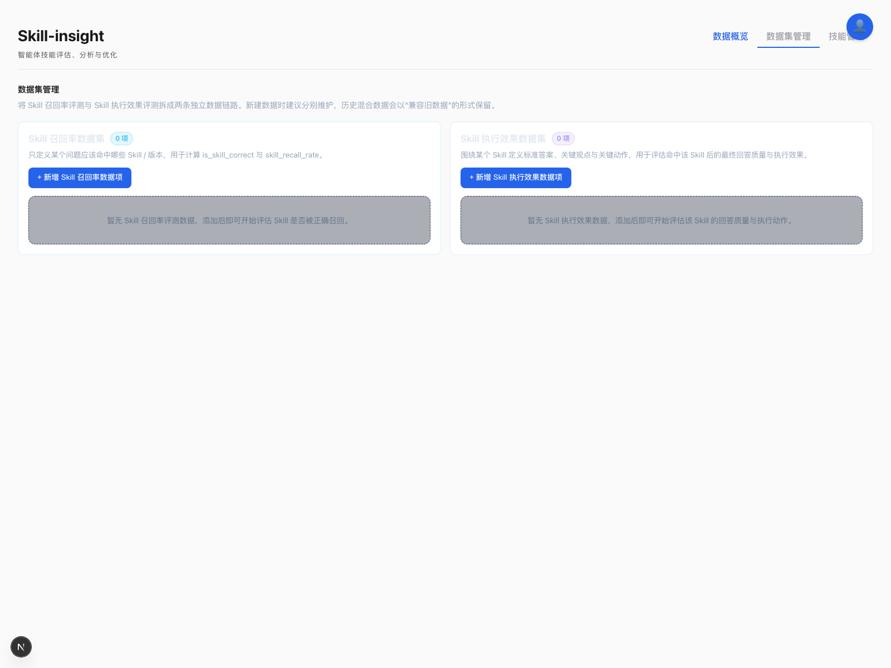
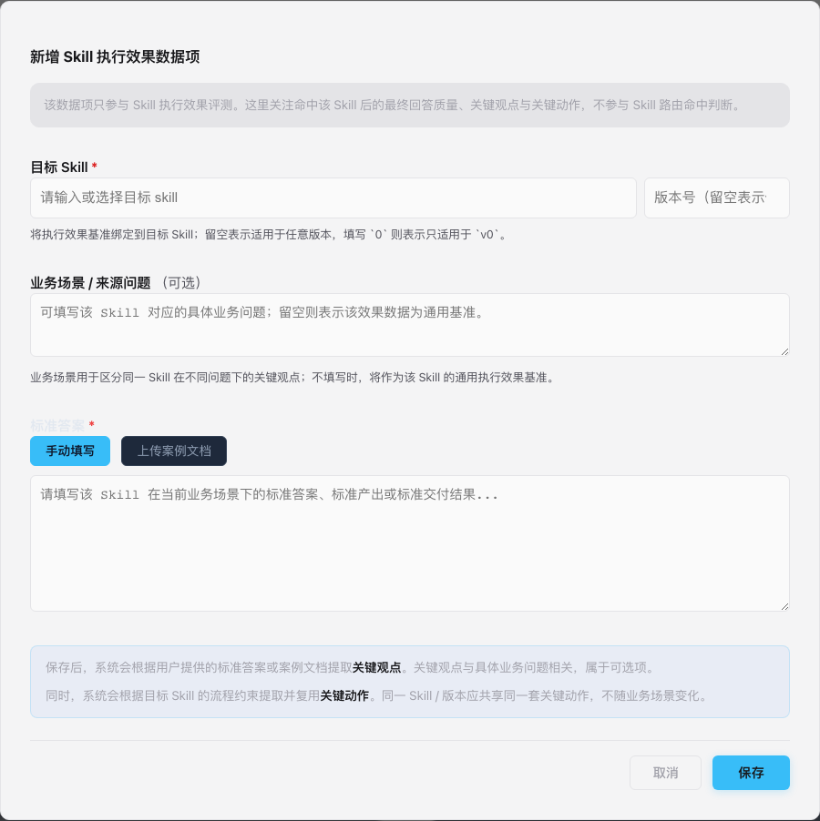
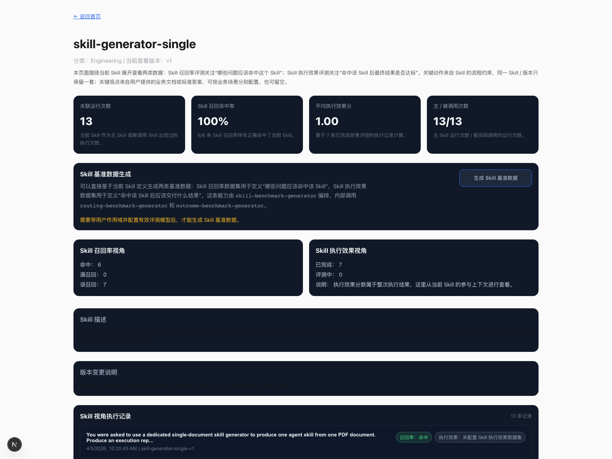

# PR #113 反馈处理说明

本文用于说明本次相对上游 `master` 的变更点，以及建议在 PR 评论中补充的截图内容。

## 本次已处理的反馈

### 1. 建议补充截图说明

建议在 PR 评论中补充以下 3 张截图：

1. 数据集管理首页
   - 展示 `Skill 召回率数据集` 与 `Skill 执行效果数据集` 两个分区
   - 说明两类数据集分别对应“是否命中 Skill”与“命中后的执行效果”

2. `Skill 执行效果数据项` 新建 / 编辑弹窗
   - 展示 `目标 Skill`、`Skill 版本`、`业务场景 / 来源问题`
   - 展示“关键观点（可按场景配置）”与“关键动作（同一 Skill 版本共用）”的说明

3. Skill 详情页
   - 展示 `Skill 版本`
   - 展示 `Skill 基准数据生成`
   - 展示 `Skill 召回率视角` 与 `Skill 执行效果视角`

当前已补充的截图文件如下：

- `docs/pr-113-screenshots/01-dataset-overview.png`
- `docs/pr-113-screenshots/02-outcome-config-modal.png`
- `docs/pr-113-screenshots/03-skill-detail.png`

可直接在 PR 评论或补充说明中引用这些图片。

### 截图预览

#### 1. 数据集管理首页

#### 2. Skill 执行效果数据项弹窗

#### 3. Skill 详情页

### 2. 平台语言统一为中文

本次已将本 PR 直接涉及的主要页面和说明统一为中文，包括：

- 数据集管理页
- 数据集弹窗说明
- Skill 详情页
- 执行记录详情中的 Skill 评测卡片
- 登录页主要按钮与输入提示

### 3. 相关字段增加说明，如 Skill 版本

本次已补充以下字段说明：

- `Skill 版本`
  - 在数据集弹窗中明确说明：填写 `0` 表示 `v0`
  - 留空表示适用于任意版本
- `业务场景 / 来源问题`
  - 明确说明仅用于区分同一 Skill 在不同场景下的关键观点
  - 留空表示该效果数据是该 Skill 的通用基准

### 4. 数据集如果与 Skill 相关建议增加相关字眼说明

本次已将相关命名统一为：

- `Skill 召回率数据集`
- `Skill 执行效果数据集`
- `Skill 召回率数据项`
- `Skill 执行效果数据项`

同时，详情页中的评测卡片也已统一改为：

- `Skill 召回率评测`
- `Skill 执行效果评测`

### 5. Skill 一般是流程约束，适合于提取关键动作；关键观点需要用户提供业务文档 / 标准答案

本次已调整实现语义：

- `关键动作`
  - 从目标 Skill 的流程约束中提取
  - 作为该 Skill / 版本的稳定执行要求
- `关键观点`
  - 从用户提供的标准答案或业务案例材料中提取
  - 与具体业务问题相关
  - 支持为空，不再强制要求

### 6. Skill 对应的关键动作只有一份，可搭配不同的关键观点

本次已按该语义调整：

- 同一 `Skill / 版本` 的 `关键动作` 会复用同一套定义
- 同一 `Skill / 版本` 允许存在多个不同 `业务场景 / 来源问题`
- 不同场景可对应不同的 `关键观点`
- 若不填写 `业务场景 / 来源问题`，则该条数据作为该 Skill 的通用效果基准

## 与实现对应的主要模块

- 数据集管理页：`src/components/Dashboard.tsx`
- 效果数据创建逻辑：`src/app/api/config/create/route.ts`
- 数据集写入归一化：`src/app/api/config/route.ts`
- Skill 执行效果匹配：`src/lib/data-service.ts`
- Skill 基准数据生成：`src/lib/skill-benchmark-generator.ts`
- 关键观点 / 关键动作提取提示词：`src/prompts/config-extraction-prompt.ts`
- Skill 详情页：`src/app/skills/page.tsx`

## 建议用于 PR 评论的简短说明

可以在 PR 评论中补充如下说明：

> 本次根据 review 意见，已将数据集管理语义进一步收敛为两类：
> 1. `Skill 召回率数据集`：只用于判断 query 是否正确命中目标 Skill / 版本；
> 2. `Skill 执行效果数据集`：只用于评估命中 Skill 后的结果质量。
>
> 其中：
> - `关键动作` 从 Skill 流程约束中提取，并在同一 Skill / 版本下复用；
> - `关键观点` 从用户提供的标准答案或业务材料中提取，可按业务场景分别配置，也可为空。
>
> 同时，本次已将相关页面和字段说明统一调整为中文，并补充了 Skill 版本、业务场景等字段说明。
